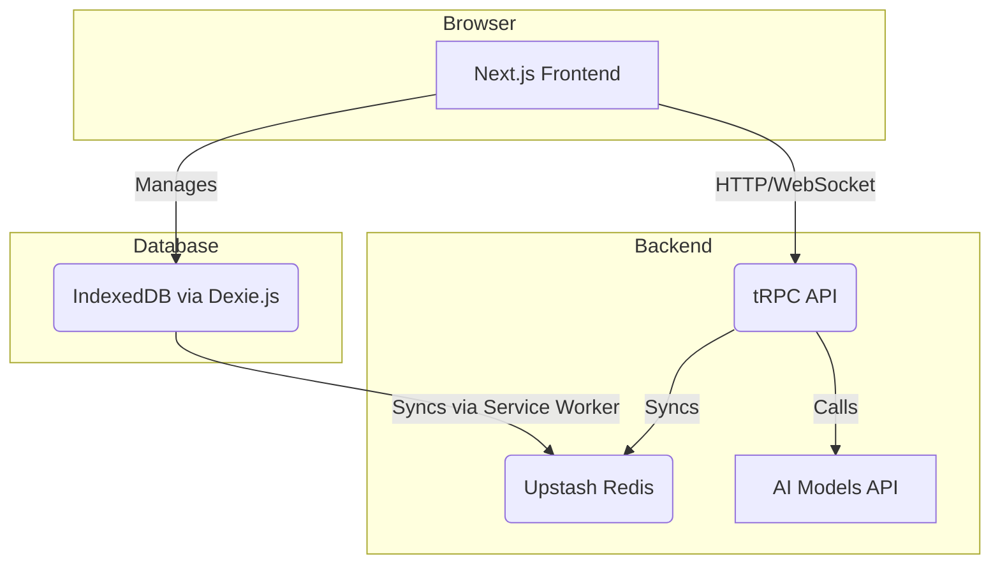

# GlassChat Architecture

This document provides a high-level overview of the GlassChat application architecture.

## System Diagram



## Component Breakdown

-   **Next.js Frontend**: The user interface of the application, built with React and Next.js. It handles rendering, state management (with React Context and Dexie.js), and user interactions. The UI will have a "glassmorphism" design.

-   **tRPC API**: The backend API that connects the frontend to the various services. It provides type-safe endpoints for all backend operations.

-   **Upstash Redis**: Used for real-time synchronization between different clients and for pub/sub messaging. This is crucial for the real-time collaboration features.

-   **AI Models API**: An abstraction layer for interacting with different AI models like OpenAI's GPT-4 and Anthropic's Claude.

-   **IndexedDB (via Dexie.js)**: The local database in the browser. It allows for a "local-first" approach, where data is stored locally and synced with the backend. This enables offline functionality.

## Data Flow: Sending a Message

1.  User types a message in the chat input and hits send.
2.  The message is saved to the local IndexedDB via Dexie.js.
3.  The UI updates immediately to show the new message (optimistic update).
4.  A tRPC call is made to the backend to send the message.
5.  The backend saves the message and broadcasts it to other users in the chat room via Upstash Redis.
6.  The backend also calls the selected AI Model API to get a response.
7.  The AI's response is sent back to the client and also broadcast to other users.
8.  The response is saved in the local IndexedDB.

## Folder Structure

Folder structure created to keep the project organized (optimize as needed):

```
glasschat/
├── src/
│   ├── app/                    # Next.js App Router
│   │   ├── layout.tsx         # Root layout with glassmorphism
│   │   └── page.tsx           # Homepage with welcome message
│   ├── components/            # React components (organized)
│   │   ├── chat/             # Chat-specific components
│   │   ├── common/           # Shared components
│   │   ├── layout/           # Layout components
│   │   └── ui/               # Base UI components
│   ├── lib/                  # Shared utilities
│   │   ├── ai/               # AI model integration
│   │   ├── db/               # Dexie.js database setup
│   │   │   └── index.ts      # ✅ Database schema implemented
│   │   └── sync/             # Real-time sync logic
│   │       └── redis.ts      # ✅ Redis client with local mock
│   ├── server/               # tRPC backend
│   ├── trpc/                 # tRPC React provider
│   │   └── react.tsx         # ✅ App Router tRPC setup
│   └── utils/                # Helper functions
├── .husky/                   # Git hooks
│   └── pre-commit            # ✅ Lint + typecheck on commit
├── LICENSE                   # ✅ MIT License
├── README.md                 # ✅ Comprehensive project docs
└── package.json              # ✅ All dependencies configured
``` 